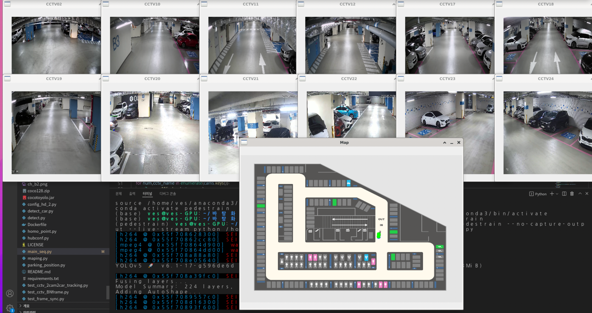
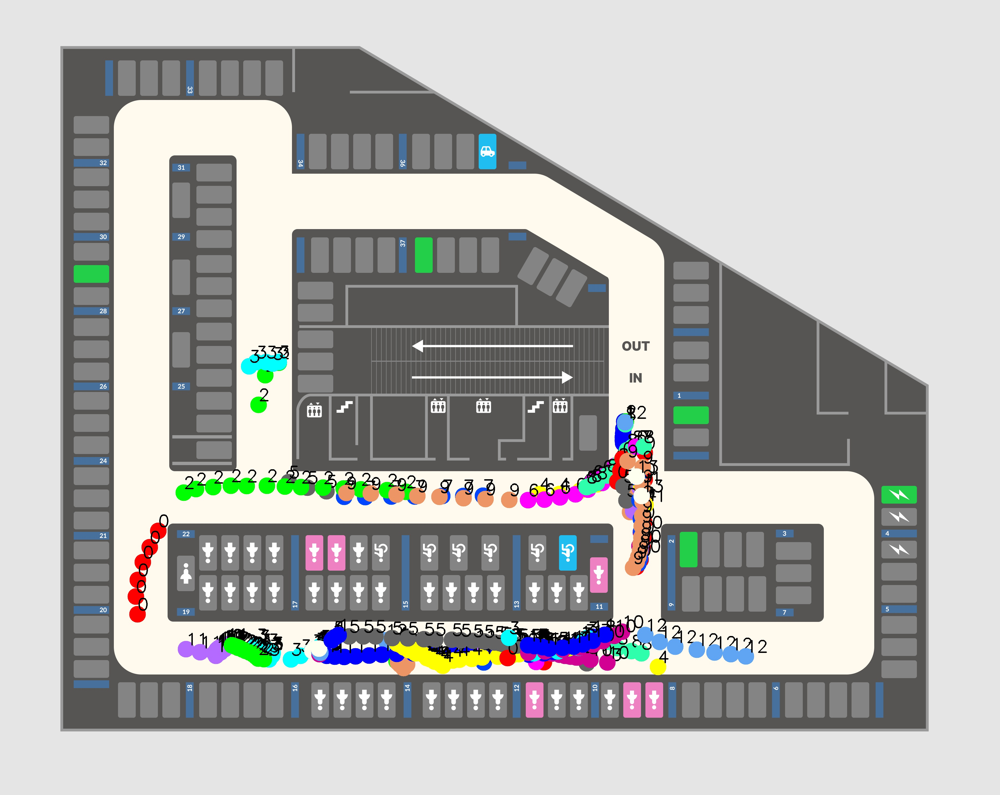

# 천호역 기준 차량 트랙킹 개발

본 개발은 천호역 주차장을 기준으로 차량을 트랙킹 하는 개발로서 원 개발자는 21년 여름 강승훈 인턴이다.
따라서, 기존에 차량 트랙킹을 위해 사용되었던 스티칭 알고리즘을 사용한다.

## 스티칭 알고리즘이란?
스티칭 알고리즘이란 다른 CCTV에서 얻어진 좌표를 통해 각 좌표들의 거리를 측정하여 두 점의 좌표가 특정 거리 이하라면은
같은 객체라고 판단하고 트랙킹을 하는 것이다.

## etc
차량 트랙킹을 위해서는 도로 영역에만 있는 차량을 검출할 수 있어야한다. 그래서 config_hd_2.py 안에 homographyt 값과
더불어 road라는 도로 영역을 표시하는 다각형 좌표 값이 있다. 그래서 이 값을 이용히여 cv2.pointPolygonTest 함수를 이용하여 특정 좌표가
다각형 내부에 있는 밖에 있는지를 판단하여 도로에 있는 차량에 대해서만 트랙킹을 한다.

## 실행 방법

~~~
# 필요한 모듈 설치
pip3 install -r requirements.txt

# 트랙킹 시작
python3 main_seq.py
~~~

~~~
# 특정 구역에서만 Object 표시

black_img = np.zeros((h, w, c), dtype=np.uint8)
road_poly=np.array(cams[cctv_name]['road'])
black_img = cv2.fillPoly(black_img,[road_poly], (255, 255, 255))
black_img = cv2.cvtColor(black_img, cv2.COLOR_BGR2GRAY)
res, thr = cv2.threshold(black_img, 127, 255, cv2.THRESH_BINARY)
contours, his = cv2.findContours(thr, cv2.RETR_EXTERNAL, cv2.CHAIN_APPROX_NONE)
cnt=contours[0]

# 차량이 도로안에 있는 것만 검출
# target_x, target_y는 객체가 검출된 중심 좌표

# 도로로 표시한 polygon안에 있는 경우에만 검출 차량이 도로에 있으면 1 없으면 -1 정확히 겹치면 0
if cv2.pointPolygonTest(cnt,(target_x,target_y),False)>-1:

    # bounding box
    cv2.rectangle(img, (x1, y1), (x2, y2), (0, 255, 0), 2)
    
    # class 이름
    cv2.putText(img, name, (x1 - 5, y1 - 5), font, 0.5, (25*5, 0, 0), 1)  
    
    # 정확도
    cv2.putText(img, "{:.2f}".format(conf), (x1 + 5, y1 - 5), font, 0.5, (255, 0, 0), 1)
~~~

## main_seq.py
수 많은 CCTV가 연결할 수 있어야 함으로 병렬으로 실행을 하되 메모리 사용은 최적으로 해야한다. 그래서 데이터를 계속해서 한 곳에 덮어씀으로서 
사용되는 메모리를 줄였으며 현재 24개까지에 대해서는 문제 없이 동작을 확인하였다.( 이는 기존 보행자 인식 코드에서 개발 되었다.)

## 기존 소스 코드
기존 소스코드들과 자료들은 너무나 많아 legacy폴더안으로 이동하였으며, 그 중 test_time_vector.py 안에는 불필요한 코드를 제거하고
주석을 추가함으로서 한결 더 간결해짐을 확인할 수 있다.

## 구현 이미지 

